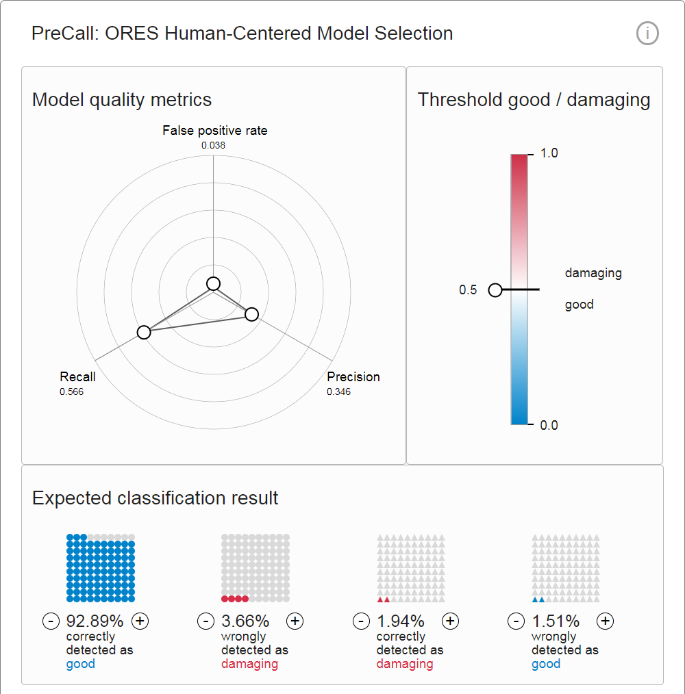

# PreCall

PreCall examines ORES, Wikimedia's Machine Learning service for quality control, and helps users determine metrics settings and decision thresholds tailored to their personal requirements, as those vary on a case-to-case basis.
PreCall currently makes use of english Wikipedia and the ORES damaging model, that predicts a damaging probability score for every edit on a wiki.

Read more here:
https://ores.wikimedia.org/
https://blog.wikimedia.org/2015/11/30/artificial-intelligence-x-ray-specs/
https://meta.wikimedia.org/wiki/Objective_Revision_Evaluation_Service/damaging
