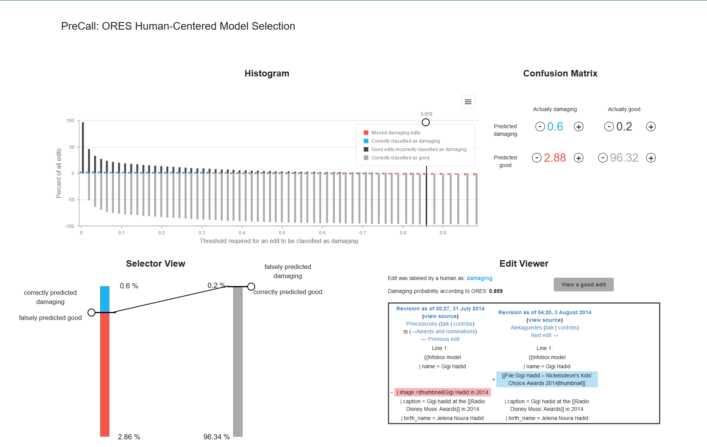

This project was bootstrapped with [Create React App](https://github.com/facebook/create-react-app).

# PreCall Extended

### Prerequisites

- You need to have `npm` installed.

### Installation and running

- Clone the repository
- run `npm install`
- run `npm start`
- go to `localhost:3000`

Alternatively the App can be found on heroku under https://stark-journey-35616.herokuapp.com/.

**Note:** Often the heroku App returns an error on the first run. If that is the case, refresh
the page once or twice. The App works.

### What is PreCall Extended

This is a fork of [tguelenman/PreCall](https://github.com/tguelenman/PreCall) and it is a visual interface 
for threshold optimization for binary machine learning classifiers. More specifically it visualizes the 
statistical data of the "damaging" model of Wikimedia's [ORES](https://ores.wikimedia.org/). The data consits
of multiple thresholds and the classifier's performance for each of them. Interacting with the components will
let you explore the dataset and see how the classifier behaves.